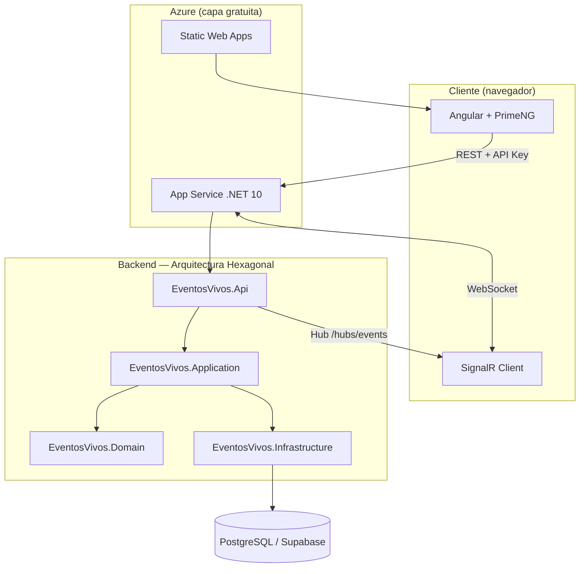
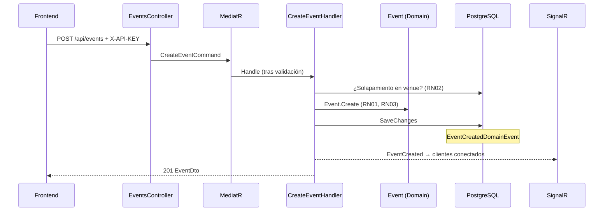
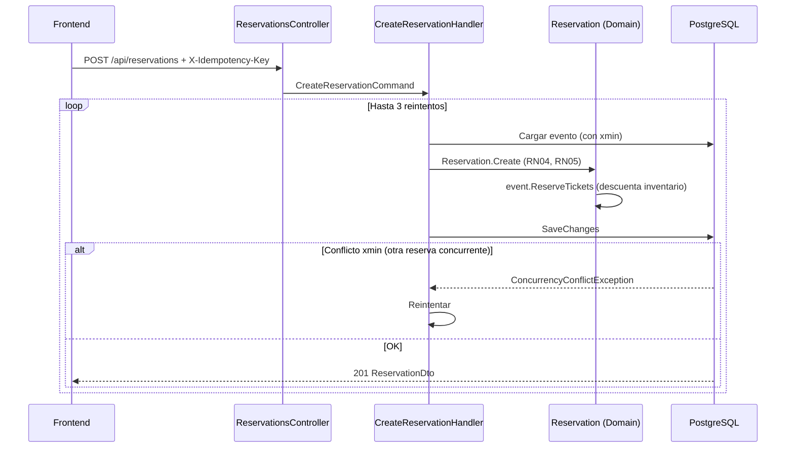
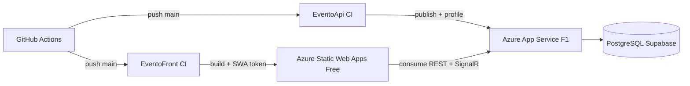

# EventosVivos — Arquitectura y funcionamiento

Documento de referencia del sistema completo: backend (.NET 10), frontend (Angular 21) e infraestructura en Azure.

| Componente | Repositorio | URL desplegada |
|---|---|---|
| API | [EventoApi](https://github.com/IngenieroCarlosBejarano26/EventoApi) | https://eventosvivos-api-t37ke2.azurewebsites.net |
| Frontend | [EventoFront](https://github.com/IngenieroCarlosBejarano26/EventoFront) | https://ambitious-moss-06713740f.7.azurestaticapps.net |
| Documentación API | — | https://eventosvivos-api-t37ke2.azurewebsites.net/scalar |

---

## 1. Visión general

EventosVivos resuelve tres problemas del negocio:

1. **Sobreventa de entradas** — el inventario se descuenta al reservar y la concurrencia optimista impide vender más de lo disponible.
2. **Conflictos de horario** — dos eventos activos no pueden ocupar el mismo venue con horarios superpuestos.
3. **Validación manual de pagos** — flujo explícito de reserva → confirmación con código único.

La solución separa **reglas de negocio** (dominio), **casos de uso** (aplicación), **detalles técnicos** (infraestructura) y **entrada/salida HTTP** (API), siguiendo **Arquitectura Hexagonal (Ports & Adapters)** con **CQRS** y **DDD táctico**.



---

## 2. Backend — capas y responsabilidades

```
EventosVivos.slnx
├── src/
│   ├── EventosVivos.Domain          ← Núcleo: entidades, reglas, eventos de dominio
│   ├── EventosVivos.Application     ← Casos de uso (CQRS), puertos, validación
│   ├── EventosVivos.Infrastructure  ← Adaptadores: EF Core, cache, servicios
│   └── EventosVivos.Api             ← Adaptador de entrada: HTTP, SignalR, seguridad
└── tests/EventosVivos.Tests         ← Unitarias + integración end-to-end
```

### 2.1 Domain (centro del hexágono)

Contiene la lógica que **no depende de frameworks**. Las reglas viven dentro de las entidades; los handlers de aplicación solo orquestan.

| Elemento | Rol |
|---|---|
| `Event`, `Reservation`, `Venue` | Agregados con encapsulación; sin setters públicos innecesarios |
| `Email`, `ReservationCode` | Value Objects con validación en el constructor/factory |
| `EventType`, `EventStatus`, `ReservationStatus` | Lenguaje ubicuo del negocio |
| `Result` / `Error` | Errores de negocio modelados sin excepciones |
| `IDomainEvent` | Hechos relevantes del dominio (reserva creada, evento completado, etc.) |

**Reglas implementadas en el dominio (ejemplos):**

| ID | Regla | Dónde |
|---|---|---|
| RN01 | Capacidad del evento ≤ capacidad del venue | `Event.Create` |
| RN02 | Sin solapamiento de eventos activos en el mismo venue | `CreateEventCommandHandler` + repositorio |
| RN03 | Fines de semana: inicio no después de las 22:00 | `Event.Create` |
| RN04 | No reservar si faltan < 1 h para el inicio | `Reservation.Create` |
| RN05 | Precio > $100 → máx. 10 entradas por transacción | `Reservation.Create` |
| RN06 | Evento completado al superar fecha de fin | `Event.MarkAsCompletedIfFinished` + background service |
| RN07 | Cancelación < 48 h → estado `Perdida` (no libera entradas) | `Reservation.Cancel` |

### 2.2 Application (casos de uso)

Organizada por **vertical slices** (una carpeta por feature):

```
Features/
├── Events/          CreateEvent, GetEvents, GetOccupancyReport
├── Reservations/    CreateReservation, ConfirmReservation, CancelReservation
└── Venues/          GetVenues
```

Cada slice contiene:

- **Command o Query** — contrato de entrada
- **Handler** — orquesta dominio + puertos
- **Validator** — FluentValidation (ejecutado automáticamente)
- **DTO** — respuesta de lectura

**Patrones clave:**

| Patrón | Implementación | Beneficio |
|---|---|---|
| CQRS | MediatR (`ICommand` / `IQuery`) | Separación lectura/escritura; handlers pequeños |
| Result Pattern | `Result<T>` en todos los handlers | Errores predecibles → HTTP sin excepciones de negocio |
| Pipeline Behaviors | `ValidationBehavior`, `LoggingBehavior` | Validación y logging transversales (DRY) |
| Ports | `IEventRepository`, `ICacheService`, `IUnitOfWork`… | Infraestructura intercambiable |

**Domain Event Handlers** (side-effects desacoplados):

- Auditoría y logging simulado
- Notificaciones simuladas (sustituibles por RabbitMQ / Azure Service Bus)
- Push en tiempo real vía `IRealtimeNotifier` → SignalR

### 2.3 Infrastructure (adaptadores de salida)

| Adaptador | Responsabilidad |
|---|---|
| `ApplicationDbContext` | EF Core + Unit of Work; publica domain events tras `SaveChanges` |
| Repositorios | Implementan interfaces de `Application.Common.Abstractions` |
| `MemoryCacheService` | Cache de listados, venues y reportes con invalidación |
| Migraciones EF | PostgreSQL; concurrencia con columna `xmin` (`IsRowVersion`) |

Al persistir, el `DbContext`:

1. Recolecta domain events de las entidades modificadas.
2. Ejecuta `SaveChangesAsync`.
3. Publica los eventos con MediatR **después** de confirmar la transacción.

Si hay conflicto de concurrencia (`DbUpdateConcurrencyException`), se traduce a `ConcurrencyConflictException` para que el handler pueda reintentar.

### 2.4 Api (adaptador de entrada)

`Program.cs` delega en extension methods (SRP):

```
AddApiServices()     → composición de servicios
UseApiPipeline()     → middleware + rutas + SignalR
InitializeDatabaseAsync() → migraciones al arrancar
```

**Pipeline HTTP (orden):**

1. `GlobalExceptionMiddleware` — excepciones no controladas → `ProblemDetails`
2. `RequestLoggingMiddleware` — logging estructurado
3. OpenAPI + Scalar (solo Development)
4. CORS (orígenes del frontend)
5. Rate Limiting (políticas configurables en `appsettings.json`)
6. Controllers REST
7. Hub SignalR en `/hubs/events`

**Seguridad y robustez:**

| Mecanismo | Header / config | Uso |
|---|---|---|
| API Key | `X-API-KEY` | Crear evento, confirmar pago |
| Idempotencia | `X-Idempotency-Key` | Crear reserva (evita duplicados) |
| Rate limiting | — | Protege endpoints sensibles |
| CORS | `Frontend:CorsOrigins` | Solo orígenes autorizados |

---

## 3. Flujos principales

### 3.1 Crear evento (RF-01)



### 3.2 Reservar entradas (RF-03) — anti-sobreventa



El inventario (`AvailableTickets`) se reduce **al crear** la reserva pendiente, no al confirmar el pago. Así ningún cliente ve entradas disponibles que ya están comprometidas.

### 3.3 Confirmar pago (RF-04)

1. Admin envía `POST /api/reservations/{id}/confirm` con `X-API-KEY`.
2. El dominio valida estado (`PendientePago` → `Confirmada`).
3. Se genera código único `EV-{6 dígitos}`.
4. Domain events → auditoría, notificación simulada y push SignalR (`EventUpdated`).

### 3.4 Cancelar reserva (RF-05 / RN07)

- Reserva **pendiente**: se cancela y se **liberan** entradas.
- Reserva **confirmada** con ≥ 48 h al evento: se cancela y se **liberan** entradas.
- Reserva **confirmada** con < 48 h: estado `Perdida`; las entradas **no** vuelven al inventario (solo cuentan en el reporte).

### 3.5 Tiempo real (SignalR)

**Backend:**

- Hub: `EventsHub` en `/hubs/events`
- `SignalRNotifier` implementa `IRealtimeNotifier`
- Handlers de domain events emiten:
  - `EventCreated` — evento nuevo (creación manual o background)
  - `EventUpdated` — cambio de disponibilidad o estado

**Frontend:**

- `RealtimeService` conecta al hub al iniciar la app.
- Al recibir `EventUpdated`, parchea `EventService` (signals).
- Al recibir `EventCreated`, inserta el evento en la lista.
- La UI reacciona sin recargar (dashboard, listado, etc.).

### 3.6 Background service (RN06)

`EventCompletionBackgroundService` (Hosted Service) ejecuta periódicamente:

1. Busca eventos activos cuya fecha de fin ya pasó.
2. Los marca como `Completado`.
3. Emite `EventCompletedDomainEvent` → SignalR + side-effects.

---

## 4. Frontend — arquitectura

```
src/app/
├── core/           Servicios, modelos, interceptores
├── features/       Pantallas por dominio funcional
│   ├── dashboard/
│   ├── events/     listar, crear
│   ├── reservations/  reservar, confirmar/cancelar
│   └── reports/    ocupación
├── app.routes.ts   Lazy loading por ruta
└── app.config.ts   PrimeNG, HTTP, interceptores
```

### 4.1 Decisiones técnicas

| Decisión | Motivo |
|---|---|
| Standalone Components | Sin NgModules; árbol más simple |
| Signals + servicios | Estado reactivo sin NgRx (alcance acotado) |
| Lazy loading | Carga bajo demanda por feature |
| Typed Reactive Forms | Formularios tipados y validación en UI |
| PrimeNG (tema neutro) | UI profesional tipo herramienta admin |
| Interceptores HTTP | `X-API-KEY` automático; errores → mensajes legibles |

### 4.2 Comunicación con la API

```
environment.apiUrl  →  https://...azurewebsites.net/api
                              │
                              ├─ EventService      → /events
                              ├─ ReservationService → /reservations
                              ├─ VenueService      → /venues
                              └─ RealtimeService   → /hubs/events (SignalR)
```

El interceptor de API Key adjunta la clave en operaciones administrativas. Las reservas públicas no la requieren, pero sí el header de idempotencia.

### 4.3 Pantallas y requerimientos

| Ruta | Pantalla | RF |
|---|---|---|
| `/` | Dashboard | Resumen + indicador SignalR |
| `/events` | Listado con filtros | RF-02 |
| `/events/create` | Crear evento | RF-01 |
| `/events/:id/reserve` | Reservar entradas | RF-03 |
| `/reservations` | Confirmar / cancelar | RF-04, RF-05 |
| `/reports` | Reporte de ocupación | RF-06 |

---

## 5. Persistencia y concurrencia

**Base de datos:** PostgreSQL (local o Supabase en producción).

**Entidades principales:**

```
Venue (1) ──< Event (N) ──< Reservation (N)
```

- Venues precargados por seed (Auditorio Central, Sala Norte, Arena Sur).
- `Event.AvailableTickets` se mantiene coherente con reservas activas.
- Concurrencia optimista: columna de sistema `xmin` mapeada como token de versión en EF Core.

**Cache (IMemoryCache):**

| Clave | Contenido | Invalidación |
|---|---|---|
| Listado de eventos | Resultado filtrado | Al crear/modificar eventos o reservas |
| Venues | Catálogo | Estático (seed) |
| Reporte de ocupación | Métricas por evento | Tras cambios en reservas |

---

## 6. Manejo de errores

Capas de defensa:

1. **FluentValidation** — errores de formato/longitud antes del handler.
2. **Result Pattern** — reglas de negocio → `Error` tipado (`Validation`, `NotFound`, `Conflict`…).
3. **ApiControllerBase** — traduce `Result` a HTTP + `ProblemDetails` con `errorCode`.
4. **GlobalExceptionMiddleware** — excepciones inesperadas → 500 estandarizado.

El frontend (`error.interceptor.ts`) lee `ProblemDetails` y muestra mensajes comprensibles al usuario.

---

## 7. Pruebas

| Tipo | Ubicación | Qué valida |
|---|---|---|
| Unitarias — dominio | `Domain/*Tests` | Reglas RN01–RN07 en entidades y VOs |
| Unitarias — handlers | `Application/Handlers/*` | Orquestación, mocks de puertos |
| Unitarias — validadores | `Application/Validators/*` | Contratos de entrada |
| Integración | `Integration/ApiIntegrationTests` | Flujo HTTP real con EF InMemory |

**Total:** 50 tests automatizados (45 unitarios + 5 integración).

---

## 8. Despliegue e infraestructura



| Recurso Azure | Función |
|---|---|
| App Service (Linux F1) | API .NET 10 + SignalR |
| Static Web Apps (Free) | SPA Angular; `staticwebapp.config.json` para rutas |
| PostgreSQL (Supabase) | Persistencia; pooler IPv4 para conectividad |

**CI/CD:** workflow en `.github/workflows/deploy.yml` de cada repo. Secrets: `AZURE_WEBAPP_PUBLISH_PROFILE` y `AZURE_STATIC_WEB_APPS_API_TOKEN`.

**Configuración en producción (App Service):**

- `ConnectionStrings__Default` — cadena PostgreSQL
- `Frontend__CorsOrigins__0` — URL del Static Web App
- `ApiKey__Key` — clave compartida con el frontend

---

## 9. Principios de diseño aplicados

| Principio | Cómo se aplica |
|---|---|
| **SRP** | `Program.cs` mínimo; extension methods por preocupación |
| **OCP** | Nuevos handlers/domain events sin modificar existentes |
| **DIP** | Application depende de abstracciones, no de EF/SQL |
| **Encapsulación** | Reglas en entidades; DTOs solo para lectura |
| **CQRS** | Commands y Queries separados por feature |
| **Event-driven** | Domain events desacoplan auditoría, notificaciones y tiempo real |

---

## 10. Extensibilidad prevista

Sin sobreingeniería, la arquitectura permite evolucionar:

- Sustituir `INotificationService` por email/SMS real o cola de mensajes.
- Reemplazar `MemoryCacheService` por Redis sin tocar handlers.
- Añadir autenticación JWT/OAuth en la capa Api sin modificar dominio.
- Escalar SignalR con Azure SignalR Service manteniendo el mismo hub.

---

*Documento generado para la prueba técnica EventosVivos. Para ejecutar el proyecto localmente, consulta el `README.md` de cada repositorio.*
